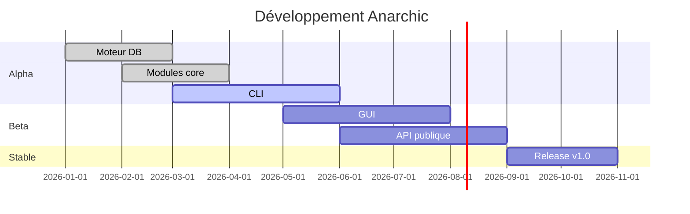

<div align="center">

```ascii
████████╗██╗  ██╗███████╗     █████╗ ███╗   ██╗ █████╗ ██████╗  ██████╗██╗  ██╗██╗ ██████╗
╚══██╔══╝██║  ██║██╔════╝    ██╔══██╗████╗  ██║██╔══██╗██╔══██╗██╔════╝██║  ██║██║██╔════╝
   ██║   ███████║█████╗      ███████║██╔██╗ ██║███████║██████╔╝██║     ███████║██║██║     
   ██║   ██╔══██║██╔══╝      ██╔══██║██║╚██╗██║██╔══██║██╔══██╗██║     ██╔══██║██║██║     
   ██║   ██║  ██║███████╗    ██║  ██║██║ ╚████║██║  ██║██║  ██║╚██████╗██║  ██║██║╚██████╗
   ╚═╝   ╚═╝  ╚═╝╚══════╝    ╚═╝  ╚═╝╚═╝  ╚═══╝╚═╝  ╚═╝╚═╝  ╚═╝ ╚═════╝╚═╝  ╚═╝╚═╝ ╚═════╝
```

<br>

# **A N A R C H I C**

### **`THE OSINT WEAPON`**

<br>

[](https://github.com/lekdev-pl/anarchic)
[]()
[]()
[]()
[]()

<br>


<br>

</div>

---

## ⚡ **OVERVIEW**

**Anarchic** est un outil OSINT nouvelle génération développé en **Python**, conçu pour la recherche et l'exploitation de bases de données multi-sources.

| | |
|---|---|
| 🎯 **Cible** | Investigateurs, pentesteurs, analystes OSINT |
| 🐍 **Langage** | Python avec compilation standalone |
| 💻 **OS** | Windows (.exe) & Linux |
| 🎨 **UI** | CLI native + GUI à venir |

---

## 🧬 **MODULES**

<div>
  <table>
    <tr>
      <td align="center"><h3>🔍<br>DB SEARCH</h3></td>
      <td>Recherche multi-sources dans les bases exposées</td>
    </tr>
    <tr>
      <td align="center"><h3>👤<br>IDENTITY</h3></td>
      <td>Cross-referencing d'identités numériques</td>
    </tr>
    <tr>
      <td align="center"><h3>🌐<br>SOCIAL</h3></td>
      <td>Analyse traces et profils réseaux sociaux</td>
    </tr>
    <tr>
      <td align="center"><h3>📡<br>NETWORK</h3></td>
      <td>Scan, WHOIS, DNS, certificats SSL</td>
    </tr>
    <tr>
      <td align="center"><h3>🔑<br>LEAKS</h3></td>
      <td>Fuites de données, credentials, dark web</td>
    </tr>
    <tr>
      <td align="center"><h3>📊<br>EXPORT</h3></td>
      <td>CSV · JSON · HTML · PDF</td>
    </tr>
  </table>
</div>

---

## 💰 **PRICING**

<div align="center">

### 🟢 **BASIC**
**Pour débuter en OSINT**

| | |
|---|---|
| 💶 **10€** | `/ mois` |
| 🔄 200 requêtes / jour |
| 🧠 Méthodes de base (30) |
| 📧 Recherche domaine & email |
| 👤 Username tracking (100 plateformes) |
| 📄 Export CSV |
| 💬 Support communautaire |

```
[  Choisir Basic  ]
```

---

### 🔥 **PRO** `POPULAIRE`
**Pour professionnels**

| | |
|---|---|
| 💶 **49€** | `/ mois` |
| 🔄 1 000 requêtes / jour |
| 🧠 Toutes les méthodes (127+) |
| 💀 Breach intelligence complète |
| 🛡️ Vuln scanning & CVE lookup |
| 📑 Rapports automatisés |
| 🔌 API REST (1 000 req/h) |
| 🌑 Dark web monitoring |
| ⭐ Support prioritaire |

```
[   Choisir Pro   ]
```

---

### 👑 **ENTERPRISE**
**Pour organisations**

| | |
|---|---|
| 💶 **199€** | `/ mois` |
| 🔄 Requêtes illimitées |
| 🧠 Toutes les méthodes (127+) |
| 🏢 On-premise déploiement possible |
| 🔌 API REST illimitée |
| 🔗 Webhooks & SIEM intégration |
| 👥 Multi-comptes (10+) |
| 📋 Rapports white-label |
| 🆘 Support dédié 24/7 |
| ✅ SLA garanti 99.9% |

```
[ Choisir Enterprise ]
```

</div>

---

## 📅 **ROADMAP**



---

## 📦 **TÉLÉCHARGEMENT**

```
📎 Anarchic-v0.0.1-alpha.exe        [Windows]    → Disponible à la release
📎 Anarchic-v0.0.1-alpha-linux      [Linux]      → Disponible à la release
📦 Source code                      [Python]     → Accès bêta réservé
```

> ⏳ **Coming soon** — Première release alpha prévue pour 2026

---

## 📜 **LICENCE**

**Propriétaire** © 2026 **Styler**

```
Tous droits réservés. Distribution, modification et usage
commercial soumis à souscription d'un abonnement actif.
```

---

<div align="center">

```
████████╗██╗  ██╗███████╗     █████╗ ███╗   ██╗ █████╗ ██████╗  ██████╗██╗  ██╗██╗ ██████╗
╚══██╔══╝██║  ██║██╔════╝    ██╔══██╗████╗  ██║██╔══██╗██╔══██╗██╔════╝██║  ██║██║██╔════╝
   ██║   ███████║█████╗      ███████║██╔██╗ ██║███████║██████╔╝██║     ███████║██║██║     
   ██║   ██╔══██║██╔══╝      ██╔══██║██║╚██╗██║██╔══██║██╔══██╗██║     ██╔══██║██║██║     
   ██║   ██║  ██║███████╗    ██║  ██║██║ ╚████║██║  ██║██║  ██║╚██████╗██║  ██║██║╚██████╗
   ╚═╝   ╚═╝  ╚═╝╚══════╝    ╚═╝  ╚═╝╚═╝  ╚═══╝╚═╝  ╚═╝╚═╝  ╚═╝ ╚═════╝╚═╝  ╚═╝╚═╝ ╚═════╝
```

**Coming soon.**

[github.com/lekdev-pl/anarchic](https://github.com/lekdev-pl/anarchic)

</div>
